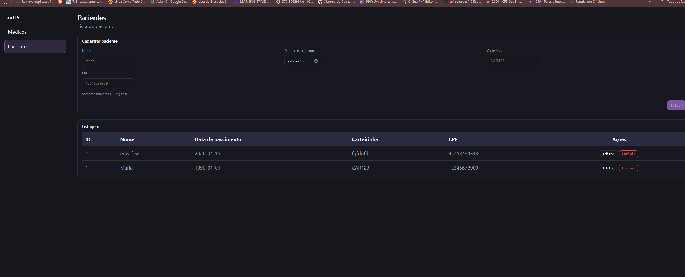

# apLIS — Sistema Fullstack (Docker)



Aplicação fullstack composta por:
- **Frontend (SPA)**: React (Vite) servido por **Nginx**
- **Backend PHP (Médicos)**: API REST (`/api/v1/medicos`)
- **Backend Node (Pacientes)**: API REST (`/api/v1/pacientes`)
- **Banco**: MySQL (compartilhado pelos dois backends)

## Estrutura

```
├── app/          # React Frontend
├── backendjs/    # Node.js API (Pacientes)
├── backendphp/   # PHP API (Médicos)
├── db/           # MySQL Schema + Seed
└── docker-compose.yml
```

## Como os serviços se comunicam

- **Rede interna Docker**: os containers se resolvem por nome de serviço (ex.: `mysql`, `backend-php`, `backend-node`)
- **Sem `localhost` entre containers**: comunicação interna via rede `internal`
- **Frontend sem CORS**: o Nginx faz proxy para as APIs
  - `/api/php/*` → `backend-php`
  - `/api/node/*` → `backend-node`

## Execução completa (Docker)

Pré-requisitos: Docker Desktop (com `docker compose`)

```bash
docker compose up --build
```

## Desenvolvimento local (frontend fora do Docker)

Suba apenas os backends e banco:

```bash
docker compose up mysql backend-node backend-php -d
```

Inicie o frontend localmente:

```bash
cd app
npm install
npm run dev
```

O frontend estará disponível em: `http://localhost:5173`

## URLs

| Serviço              | URL                                         |
|----------------------|---------------------------------------------|
| Frontend             | `http://localhost:8080`                     |
| API Médicos (PHP)    | `http://localhost:3002/api/v1/medicos`      |
| API Pacientes (Node) | `http://localhost:3001/api/v1/pacientes`    |
| MySQL                | `localhost:3306`                            |

## Banco de dados

- **Persistência**: volume `mysql_data`
- **Bootstrap**: na primeira execução (volume vazio), o MySQL executa `db/init.sql` criando as tabelas e inserindo médicos de exemplo

## Variáveis de ambiente

Copie o arquivo de exemplo e preencha as credenciais:

```bash
cp .env.example .env
```

As variáveis controlam credenciais do MySQL e portas expostas pelo Docker.

## Testes

```bash
# Frontend (Vitest)
cd app && npm test

# Backend Node (Vitest)
cd backendjs && npm test

# Backend PHP (PHPUnit)
cd backendphp && ./vendor/bin/phpunit
```
